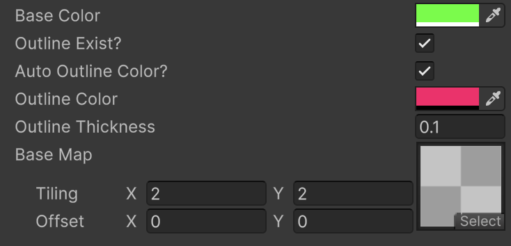
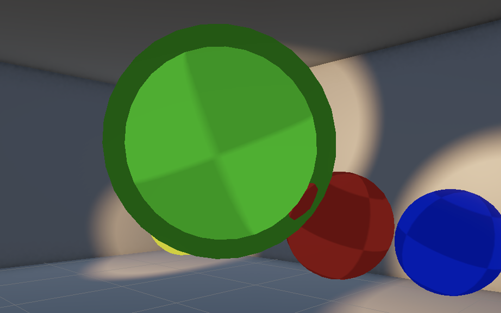

# HLSL-Shader
## HLSL Shader Creation in Unity URP

I created an outline shader with HLSL as a learning project. I became familiar with basic HLSL and ShaderLab syntax for Unity's Universal Rendering Pipeline.

My outline shader has several adjustable attributes which can be changed in the material editor. 
I enjoyed learning about toggles, which enabled me to let the user of the material toggle on and off the outline, and allow for the toggling of a mathematically predetermined border color, versus being able to manually select the color for the outline.
Additionally, the user of the material can adjust the base color, select a texture, adjust the tiling of the texture, and the width of the outline.

## In Progress and Future Directions

My goal for this project was to learn the fundamentals of HLSL and ShaderLab code. I now feel I have a solid understanding of variable declaration, syntax, and some conventions.

If I had more time, I would fix this border intersection bug. The effect would look seamless, even for up close, story-driven scenes.